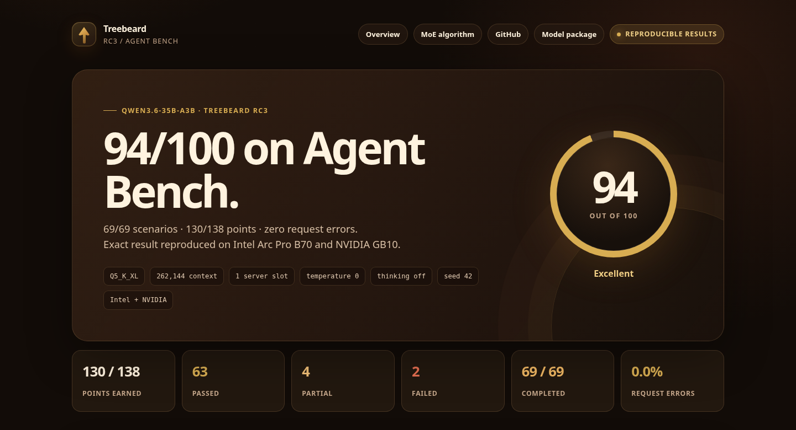

# Treebeard

Treebeard is a ready-to-run Linux package for Qwen3.6-35B-A3B. It combines a
Q5_K_XL GGUF model, platform-specific runtimes, an OpenAI-compatible server,
and a verified one-command installer.

**[View the 94/100 Agent Bench report](https://newjordan.github.io/treebeard/)**
| **[Read the MoE algorithm explainer](https://newjordan.github.io/treebeard/moe-routing.html)**
| **[Download the model package](https://huggingface.co/Frosty40/Treebeard-Qwen3.6-35B-A3B-GGUF)**
| **[GitHub repository](https://github.com/newjordan/treebeard)**



## Install

Linux users can install the model and the best packaged runtime for their host
with one command:

```bash
curl -fsSL https://raw.githubusercontent.com/newjordan/treebeard/main/install.sh | bash
~/.local/bin/treebeard doctor
~/.local/bin/treebeard serve
```

The text install downloads about 26.7 GB and needs roughly 32 GB of system or
unified memory. Downloads resume after interruption, and every installed file
is verified by SHA-256. Add the optional 0.9 GB vision projector with:

```bash
curl -fsSL https://raw.githubusercontent.com/newjordan/treebeard/main/install.sh | \
  bash -s -- --multimodal
```

The installed server exposes an OpenAI-compatible local API:

```bash
curl http://127.0.0.1:8093/v1/chat/completions \
  -H 'Content-Type: application/json' \
  -d '{
    "model": "treebeard",
    "messages": [{"role": "user", "content": "Hello from the forest."}],
    "max_tokens": 96,
    "chat_template_kwargs": {"enable_thinking": false}
  }'
```

## Validated platforms

| Backend | Platform | Validated hardware | Host requirement |
| --- | --- | --- | --- |
| Portable CPU | Linux x86_64 | AMD Ryzen 9 5950X | glibc 2.35+ |
| Intel SYCL | Linux x86_64 | Intel Arc Pro B70 | oneAPI 2026 and Level Zero |
| NVIDIA CUDA | Linux ARM64 | NVIDIA GB10 | CUDA 13 runtime, cuBLAS, compatible driver |

The NVIDIA-accelerated package is the ARM64 GB10 path validated for this
release. NVIDIA x86_64 hosts automatically receive the portable CPU runtime;
GPU acceleration for that platform is not included in RC3. Hardware outside
this table is unverified even when it starts successfully.

The model weights are one 26.6 GB GGUF file. Running that file still requires
architecture-specific software, so Treebeard installs the matching runtime
beside it rather than presenting a universal binary as a platform guarantee.

## Agent Bench

Treebeard scored **94/100 (Excellent)** and 130/138 points on a complete
69-scenario agent benchmark:

- 63 pass, 4 partial, 2 fail;
- 69/69 scenarios completed with zero request errors;
- one server slot, one benchmark worker, 262,144-token context;
- temperature 0, thinking disabled, seed 42;
- exact score and verdict-vector reproduction on Intel Arc Pro B70 and NVIDIA
  GB10.

The [public report](https://newjordan.github.io/treebeard/) includes the
methodology, exceptions, cross-platform comparison, and machine-readable
results. The [results index](results/README.md) catalogs the supporting
performance, correctness, package, and health evidence.

Selected measurements:

| Measurement | Result |
| --- | ---: |
| NVIDIA GB10 native pp4096 | 2,422.325 tok/s |
| NVIDIA GB10 native tg128 | 59.614 tok/s |
| NVIDIA Blackwell Q8_0 direct 12-column speedup | 31.49% |
| NVIDIA Blackwell Q8_0 MoE down speedup | 4.01% |
| Intel B70 12-slot aggregate serving | 194.023 tok/s |
| Ryzen 5950X installed-package chat smoke | 9.30 tok/s |

## CLI

```text
treebeard serve       Start the OpenAI-compatible API
treebeard doctor      Check platform selection and print the launch command
treebeard verify      Verify installed model, runtime, and launch files
treebeard status      Query the local health endpoint
treebeard report      Print the agent benchmark URL
treebeard help
```

Quality mode is the default. Use environment variables to tune it:

```bash
TREEBEARD_CONTEXT=8192 TREEBEARD_PORT=8080 treebeard serve
TREEBEARD_PROFILE=throughput treebeard serve
TREEBEARD_BACKEND=cpu treebeard doctor
TREEBEARD_REASONING=bounded treebeard serve
TREEBEARD_SPECULATION=ngram treebeard serve
```

The validated GPU quality profile uses one slot and 262,144 total context
tokens. The portable CPU default is one slot and 32,768 context tokens. The
GPU throughput profile uses 12 slots and is separate from the single-slot
evaluation above.

Reasoning is explicitly off by default, matching the validated 94/100 agent
benchmark. `TREEBEARD_REASONING=bounded` enables a small thinking allowance:
64 tokens on GPU or 16 on CPU. Override it with a positive integer in
`TREEBEARD_REASONING_BUDGET`. `TREEBEARD_REASONING=unrestricted` removes the
budget and can substantially increase latency and generated-token cost. API
clients can still opt individual requests into thinking with request-level
chat-template and thinking-budget controls.

For selective thinking on the default-off server, enable and bound the exact
OpenAI-compatible request:

```bash
curl -s http://127.0.0.1:8093/v1/chat/completions \
  -H 'Content-Type: application/json' \
  -d '{
    "model": "treebeard",
    "messages": [{"role": "user", "content": "Check this plan for a subtle race."}],
    "max_tokens": 256,
    "chat_template_kwargs": {"enable_thinking": true},
    "thinking_budget_tokens": 64
  }'
```

`max_tokens` covers the reasoning tokens and final answer together. Agentic
tool loops issue another completion after each tool result, so each model turn
receives a fresh thinking budget; budget the full loop, not just one request.
The pinned b9624 runtime honors the selective example because the default-off
launcher leaves the global budget unrestricted for explicit requests. A
globally bounded server works, but a smaller per-request override of that
global budget requires a rebuilt runtime with the newer request-precedence
fix. Newer Anthropic thinking-control translations likewise are not present in
the packaged RC3 binaries; the example above is the supported selective path.

Speculative decoding is also opt-in through
`TREEBEARD_SPECULATION=off|ngram|mtp|hybrid`. The `ngram` mode uses a
conservative prompt-reuse configuration. `mtp` uses Qwen3.6's native one-layer
MTP head, and `hybrid` tries n-gram reuse before MTP. These modes use features
present in the packaged b9624 runtime, but they have not been validated as a
Treebeard speedup. Acceptance rate, latency, memory use, and quality must be
measured on the intended workload.

## Repository map

- `install.sh` - public resumable, verified Linux installer;
- `package/` - launcher, CLI, profiles, package contract, and benchmark docs;
- `docs/` - static agent benchmark report and MoE routing explainer;
- `results/` - checksum-pinned performance and evaluation evidence;
- `source/` - the exact NVIDIA Blackwell CUDA patch used for validation;
- [Hugging Face model package](https://huggingface.co/Frosty40/Treebeard-Qwen3.6-35B-A3B-GGUF)
  - model, projector, standard Qwen metadata, runtimes, and manifests.

## Integrity and provenance

- Treebeard integration commit: `6a6dc2def952fe5e9b2da81e638968653b6be3db`;
- model SHA-256: `25233af7642e3a91bd52cc4aeefdbd4a117479088e06cf1aea5b6bedb443c506`;
- NVIDIA patch SHA-256: `c1e0780c96432059ea7a517f6ab2db935f1083da065ed0a9009a00d944c3415f`;
- base model: `Qwen/Qwen3.6-35B-A3B`;
- GGUF source: `unsloth/Qwen3.6-35B-A3B-GGUF`.

The published evidence remains checksum-pinned so the reported results can be
verified independently. Product, package, installer, and report surfaces use
the Treebeard name consistently.

## Security and license

The server binds to loopback by default. Do not expose it publicly without an
authenticated TLS proxy and firewall rules. The benchmark tool implementations
are deterministic mocks; production integrations still need authorization,
argument validation, side-effect confirmation, sandboxing, and audit logs.

Model and tokenizer assets are Apache-2.0. llama.cpp-derived runtimes are MIT.
See `LICENSE`, `LICENSE-RUNTIME`, and `NOTICE.md`. Treebeard is not an official
Qwen, Unsloth, NVIDIA, Intel, Hugging Face, or llama.cpp release.
