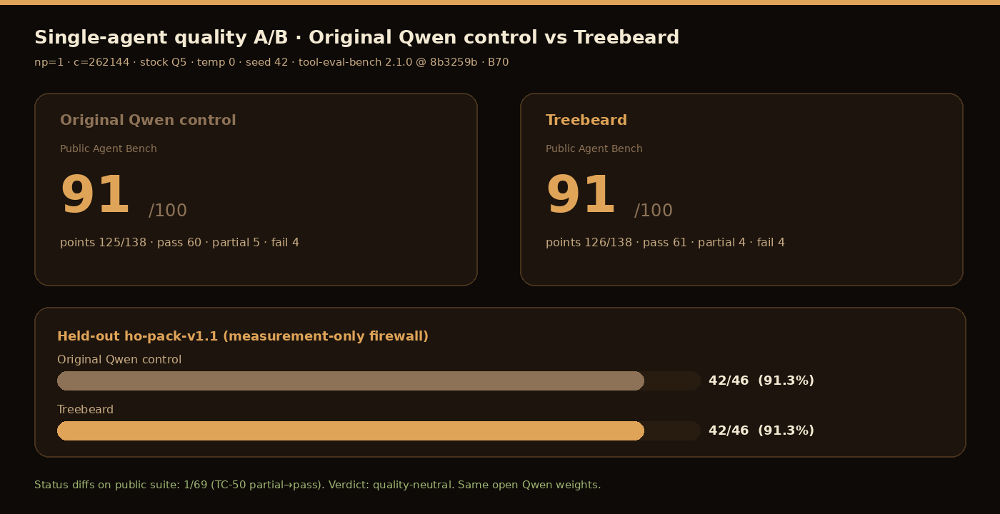

# Treebeard release notes - dual-axis + private verification pack (2026-07-28)

## Claims

[CLAIMS.md](CLAIMS.md) (evidence paths) and [no-ai-slop](https://github.com/newjordan/no-ai-slop) (copy style).

## Control A/B (stock Q5, B70, 2026-07-28)

| Test | Shape | Control | Treebeard | Artifact |
|------|-------|--------:|----------:|----------|
| tool-eval-bench public 69 | np=1 · c=262144 · seed 42 · 2.1.0@8b3259b | 91/100 (125/138) | 91/100 (126/138) | `…/agent-bench-ab-20260728T220230Z/` |
| ho-pack-v1.1 | np=1 · seed 42 | 42/46 | 42/46 | same · `heldout/` |
| sequential tg_p50 | np=1 · c=32768 · 5×2 | 77.1 t/s | 88.9 t/s | `…/single-agent-ab-20260728T213156Z/` |
| 12-agent ABA p50/agent | np=12 · n_predict=96 | 6.88 | 26.33 | `…/base-vs-package-aba-20260728T204515Z/` |

## Named freeze (different pin/quant context)

| Test | Result | Artifact |
|------|--------|----------|
| tool-eval-bench 69 freeze (B70 + GB10) | 94/100 both | `results/agent/single-slot-94/` |

## Treebeard-only runs (no control arm)

| Test | Result | Artifact |
|------|--------|----------|
| Broadway HTML ×6 | 6/6 | `…/broadway-eval-…/` |
| Long needles | 3/3 | `…/longctx-eval-…/` |
| Dossier QA | 14/14 | same |
| Long multi-slot stress | 120/120 | `…/long-multislot-stress-…/` |

Day package: `results/private-verification-20260728/DAY_PACKAGE_20260728.md`

Docs-only pack. Package version stays 0.1.0-rc.3 / 0.2.0-rc.1 until a new runtime archive ships.

Historical multi-slot ship-stack lift of about +28.7% is concurrent-only. Sequential single-stream on that package was about +2%.

---

## Private verification pack (2026-07-28) - package positives on latest

Port of symbiotic SYCL ship positives onto current `llama.cpp` master for private gates (stock Q5 weights for engine fairness).

### Multi-slot vs Original Qwen control (matched stock Q5)

True control A/B (clean upstream vs Treebeard package):

| Arm | p50 tok/s/agent |
|-----|----------------:|
| Original Qwen control | **6.88** |
| Treebeard knobs-off (intermediate) | **21.81** |
| Treebeard | **26.33** |
| **Lift vs control** | **+282.8%** |

Internal knobs-only lift (same Treebeard binary, envs on vs off): **+21.0%** (21.94 → 26.54) - not the control.

### Leave-one-out (what belongs in the package)

| Mode | p50 | Note |
|------|----:|------|
| package | 26.54 | full set |
| −ncols32 | 26.33 | mild help |
| −shared_act | 26.58 | ~flat |
| −deferred | 26.70 | **cut candidate** (slightly faster without) |
| −expert-grouped | 25.79 | keep |
| −rps4 | 24.87 | keep |
| −GDN | 22.67 | keep (largest multi-slot piece) |
| knobs-off | 21.94 | all package envs off |

### Real-world + long-context gates

| Gate | Result |
|------|--------|
| Broadway multi-site HTML (6 pages, multi-era) | **6/6 · 100%** structure |
| Needle-in-haystack (3 depths, ~65k-char doc) | **3/3** |
| Broadway long dossier QA | **14/14** |
| Long multi-slot stress `c=262144` `np=12` | **120/120 · 100%** |

---

## What this is (identity)

| Layer | Treebeard |
|-------|-----------|
| Weights | Qwen3.6-35B-A3B (commodity) |
| Engine | llama.cpp + ggml (MIT), specialized SYCL/CUDA paths |
| Product | Installer · package · Agent Bench proof · concurrent serving pins |
| Contribution shape | Downstream llama.cpp specialization for multi-slot MoE agent serving |

---

## Package members (engine positives)

Default-on / ship-shaped: GDN out-flat · MoE-down rps4 · expert-grouped · Q8 multi-col geometry · dual shared-act · Q8 vec4 / Q6 aligned paths · fusion defaults as shipped.

**Out of engine PR package:** q8down quant (weights) · LoRA · StateTree product · PARK regressions.

---

## Release checklist

- [x] Dual-axis freeze written
- [x] Package ablation on latest (private)
- [x] True Original Qwen control vs Treebeard multi-slot
- [x] Single-agent quality A/B (Agent Bench 69 + held-out) - **91=91 / 91.3=91.3**
- [x] Single-agent sequential speed A/B (~+15% tg)
- [x] Broadway real-world sites
- [x] Long-context needles + dossier
- [x] Long multi-slot stress 262k×12
- [x] Charts + hero art generated
- [x] Honest package docs (quality first, fleet demoted)
- [ ] GitHub: merge docs PR / tag notes
- [ ] Optional: SYCL runtime rebuild pin for next RC
- [ ] Optional: HF model card refresh (weights unchanged unless quant ship)

---

## Version note

Current public package remains **0.1.0-rc.3** until a new runtime archive is built and checksum-pinned. This release pack updates **documentation, evidence, and charts** for the dual-axis + verification story. Runtime binary bump is a follow-on if you promote the latest package port to ship.

---

## llama.cpp PR preparation

Private measurement package is ready; upstream PR is **not opened** until rebase +
hygiene (rename `TREEBEARD_*` → `GGML_SYCL_*`, strip diagnostics, cut deferred
default). Full prep checklist and draft PR body:

- `results/private-verification-20260728/LLAMA_CPP_PR_PREP.md`

## Links

- Report / site: https://newjordan.github.io/treebeard/ (after merge / Pages deploy)
- Docs PR: https://github.com/newjordan/treebeard/pull/1
- GitHub: https://github.com/newjordan/treebeard
- HF: https://huggingface.co/Frosty40/Treebeard-Qwen3.6-35B-A3B-GGUF

---

## CORRECTION - true base control (2026-07-28 evening)

Earlier private ablation labeled **package knobs-off** as "parent." That was **wrong**
for product claims. True control is clean upstream llama.cpp + stock Qwen weights.

### True multi-slot ABA (c=262144 np=12 n_predict=96, stock Q5 all arms)

| Arm | Binary | p50 tok/s/agent |
|-----|--------|----------------:|
| **base** (true control) | clean upstream SYCL @ pin `7e1e28cae` | **6.88** |
| knobs_off (old mislabeled "parent") | package binary, package knobs forced off | **21.81** |
| **package** | package binary + package env | **26.33** |

### Lifts (honest)

| Comparison | Lift | Meaning |
|------------|-----:|---------|
| **package vs base** | **+282.8%** | Full package stack vs stock Qwen serving (true claim axis) |
| knobs_off vs base | +217.1% | Most of the win is **compiled package SYCL/code**, not env knobs alone |
| package vs knobs_off | **+20.7%** | Env package pins on top of package code (old internal ablate) |

**Do not** call knobs_off "parent" or "base Qwen."  
**Do not** treat +21% as the full package-vs-stock story.  
Source: `results/private-verification-20260728/base-vs-package-aba-20260728T204515Z/`

