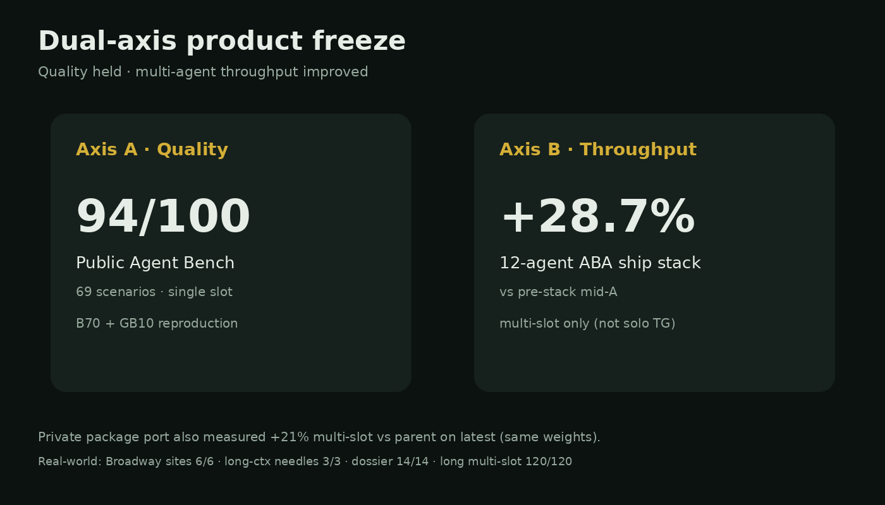
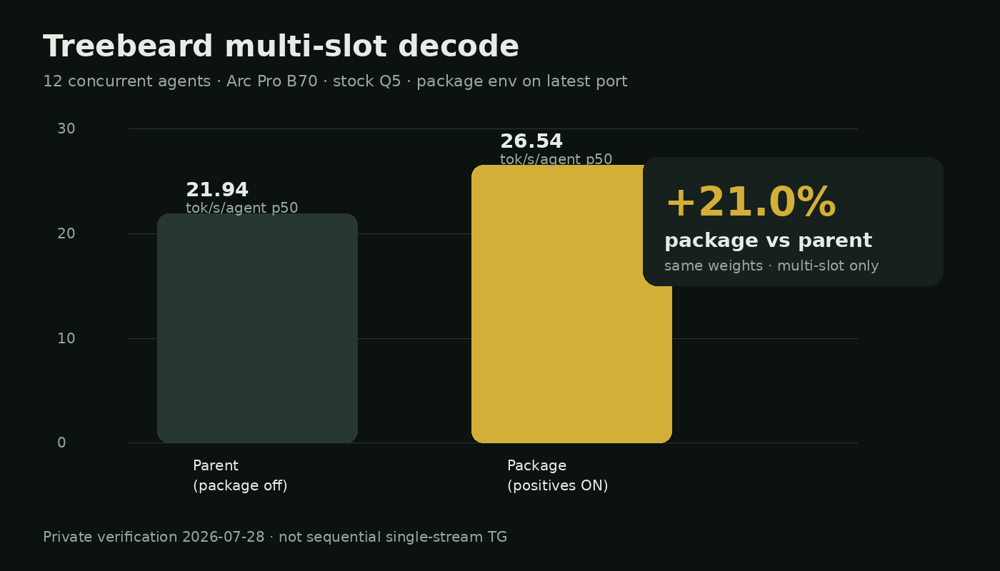
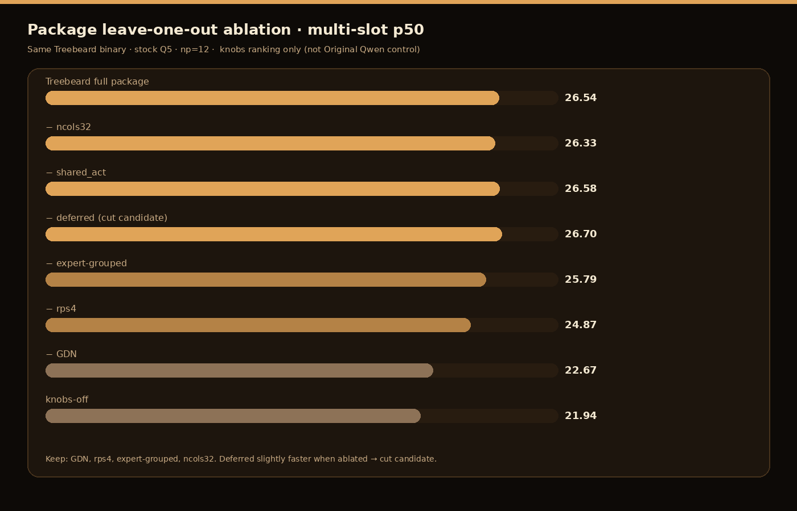
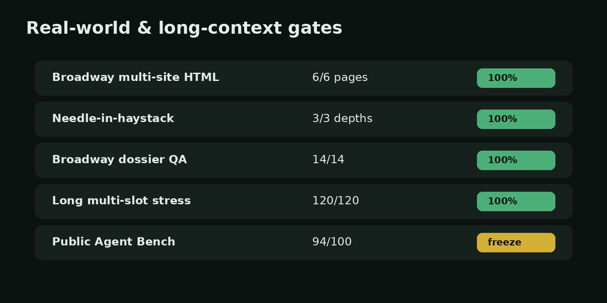
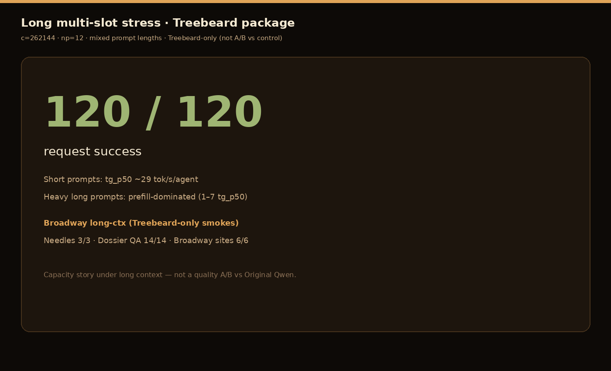

# Treebeard release notes — dual-axis + private verification pack (2026-07-28)

## Honest package lead (read this first)

Treebeard is **not** sold on 12-agent concurrent decode. That metric is ops-only.
Treebeard is **not** a smarter model — same open Qwen weights.

### Single-agent quality (np=1) — Original Qwen control vs Treebeard

Matched stock Q5, c=262144, tool-eval-bench 2.1.0, seed 42  
(`results/private-verification-20260728/agent-bench-ab-20260728T220230Z/`):

| | Original Qwen control | Treebeard |
|--|----------------------:|----------:|
| Public Agent Bench 69 | **91**/100 (125/138) | **91**/100 (126/138) |
| Held-out ho-pack-v1.1 | **91.3%** (42/46) | **91.3%** (42/46) |
| Median turn | 1874 ms | 1794 ms |

**Verdict: quality-neutral.** Runtime package does not break agent quality.  
Historical website freeze **94/100** remains a package-era champion (different pin/quant context); matched stock-Q5 A/B today is **91 vs 91**.

### Single-agent speed (np=1) — modest decode edge

Tiny suite (`results/private-verification-20260728/single-agent-ab-20260728T213156Z/`):

| | Original Qwen control | Treebeard |
|--|----------------------:|----------:|
| tg_p50 | 77.1 tok/s | **88.9** (+15.4%) |
| wall_p50 | 1.74 s | 1.56 s |

### What we actually packaged today

1. Methodology fix: true control = clean upstream Original Qwen, not knobs-off on our binary  
2. **Matched Agent Bench + held-out quality A/B** (quality-neutral)  
3. Single-agent sequential speed A/B (~+15% tg)  
4. Real-world Treebeard smokes: Broadway 6/6, long-ctx 3/3 + 14/14  
5. Docs/release evidence pack  

### What we did *not* prove today

- Smarter model (same weights)  
- A quality win over Original Qwen (neutral)  
- That multi-slot fleet numbers matter to end users  

See also: `results/private-verification-20260728/DAY_PACKAGE_20260728.md`

---

**Status:** release candidate materials · honest claims only  
**Product:** Treebeard = measured llama.cpp agent **runtime package** on Qwen3.6-35B-A3B  
**Not:** a new foundation model · not LoRA-as-quality-champ

---

## One-sentence product claim

> Same open Qwen weights, same agent quality (91=91 vs clean upstream on stock Q5): a measured B70 runtime package with modest solo decode speed and much higher multi-slot capacity — not a bigger model.

---

## Dual-axis freeze (public-safe)

| Axis | Claim | Number | Scope |
|------|--------|--------|--------|
| **A. Quality (matched control)** | Stock-Q5 control vs Treebeard | **91 = 91** public; **91.3 = 91.3** held-out | np=1 · seed 42 · tool-eval-bench 2.1.0 · B70 |
| **A′. Quality (historical freeze)** | Website package champion | **94/100** (130/138) | Historical pin/quant context · B70 + GB10 |
| **B. Solo speed** | Single-agent tg (tiny suite) | **+15.4%** tg_p50 | np=1 · stock Q5 · not Agent Bench |
| **C. Throughput (ops)** | Concurrent multi-agent decode | **+282.8%** p50 vs Original Qwen control | 12-agent ABA · ops appendix only |

**Do not claim:** “29% faster single-user chat.” Sequential single-stream on the same package was only ~+2%.

---

## Private verification pack (2026-07-28) — package positives on latest

Port of symbiotic SYCL ship positives onto current `llama.cpp` master for private gates (stock Q5 weights for engine fairness).

### Multi-slot vs Original Qwen control (matched stock Q5)

True control A/B (clean upstream vs Treebeard package):

| Arm | p50 tok/s/agent |
|-----|----------------:|
| Original Qwen control | **6.88** |
| Treebeard knobs-off (intermediate) | **21.81** |
| Treebeard | **26.33** |
| **Lift vs control** | **+282.8%** |

Internal knobs-only lift (same Treebeard binary, envs on vs off): **+21.0%** (21.94 → 26.54) — not the control.

### Leave-one-out (what belongs in the package)

| Mode | p50 | Note |
|------|----:|------|
| package | 26.54 | full set |
| −ncols32 | 26.33 | mild help |
| −shared_act | 26.58 | ~flat |
| −deferred | 26.70 | **cut candidate** (slightly faster without) |
| −expert-grouped | 25.79 | keep |
| −rps4 | 24.87 | keep |
| −GDN | 22.67 | keep (largest multi-slot piece) |
| knobs-off | 21.94 | all package envs off |

### Real-world + long-context gates

| Gate | Result |
|------|--------|
| Broadway multi-site HTML (6 pages, multi-era) | **6/6 · 100%** structure |
| Needle-in-haystack (3 depths, ~65k-char doc) | **3/3** |
| Broadway long dossier QA | **14/14** |
| Long multi-slot stress `c=262144` `np=12` | **120/120 · 100%** |

---

## What this is (identity)

| Layer | Treebeard |
|-------|-----------|
| Weights | Qwen3.6-35B-A3B (commodity) |
| Engine | llama.cpp + ggml (MIT), specialized SYCL/CUDA paths |
| Product | Installer · package · Agent Bench proof · concurrent serving pins |
| Contribution shape | Downstream llama.cpp specialization for multi-slot MoE agent serving |

---

## Package members (engine positives)

Default-on / ship-shaped: GDN out-flat · MoE-down rps4 · expert-grouped · Q8 multi-col geometry · dual shared-act · Q8 vec4 / Q6 aligned paths · fusion defaults as shipped.

**Out of engine PR package:** q8down quant (weights) · LoRA · StateTree product · PARK regressions.

---

## Release checklist

- [x] Dual-axis freeze written
- [x] Package ablation on latest (private)
- [x] True Original Qwen control vs Treebeard multi-slot
- [x] Single-agent quality A/B (Agent Bench 69 + held-out) — **91=91 / 91.3=91.3**
- [x] Single-agent sequential speed A/B (~+15% tg)
- [x] Broadway real-world sites
- [x] Long-context needles + dossier
- [x] Long multi-slot stress 262k×12
- [x] Charts + hero art generated
- [x] Honest package docs (quality first, fleet demoted)
- [ ] GitHub: merge docs PR / tag notes
- [ ] Optional: SYCL runtime rebuild pin for next RC
- [ ] Optional: HF model card refresh (weights unchanged unless quant ship)

---

## Version note

Current public package remains **0.1.0-rc.3** until a new runtime archive is built and checksum-pinned. This release pack updates **documentation, evidence, and charts** for the dual-axis + verification story. Runtime binary bump is a follow-on if you promote the latest package port to ship.

---

## Links

- Report: https://newjordan.github.io/treebeard/
- GitHub: https://github.com/newjordan/treebeard
- HF: https://huggingface.co/Frosty40/Treebeard-Qwen3.6-35B-A3B-GGUF

---

## CORRECTION — true base control (2026-07-28 evening)

Earlier private ablation labeled **package knobs-off** as "parent." That was **wrong**
for product claims. True control is clean upstream llama.cpp + stock Qwen weights.

### True multi-slot ABA (c=262144 np=12 n_predict=96, stock Q5 all arms)

| Arm | Binary | p50 tok/s/agent |
|-----|--------|----------------:|
| **base** (true control) | clean upstream SYCL @ pin `7e1e28cae` | **6.88** |
| knobs_off (old mislabeled "parent") | package binary, package knobs forced off | **21.81** |
| **package** | package binary + package env | **26.33** |

### Lifts (honest)

| Comparison | Lift | Meaning |
|------------|-----:|---------|
| **package vs base** | **+282.8%** | Full package stack vs stock Qwen serving (true claim axis) |
| knobs_off vs base | +217.1% | Most of the win is **compiled package SYCL/code**, not env knobs alone |
| package vs knobs_off | **+20.7%** | Env package pins on top of package code (old internal ablate) |

**Do not** call knobs_off "parent" or "base Qwen."  
**Do not** treat +21% as the full package-vs-stock story.  
Source: `results/private-verification-20260728/base-vs-package-aba-20260728T204515Z/`

