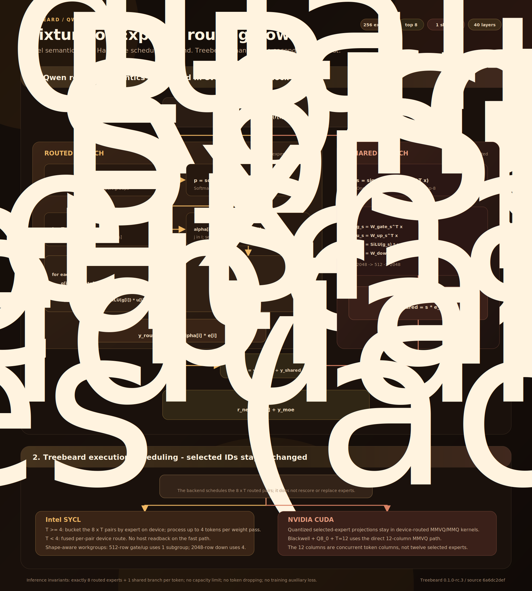
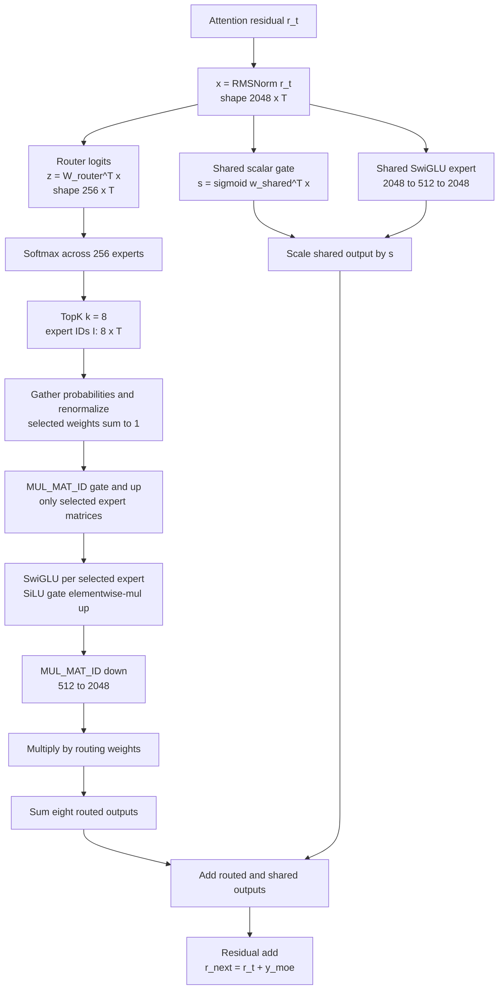
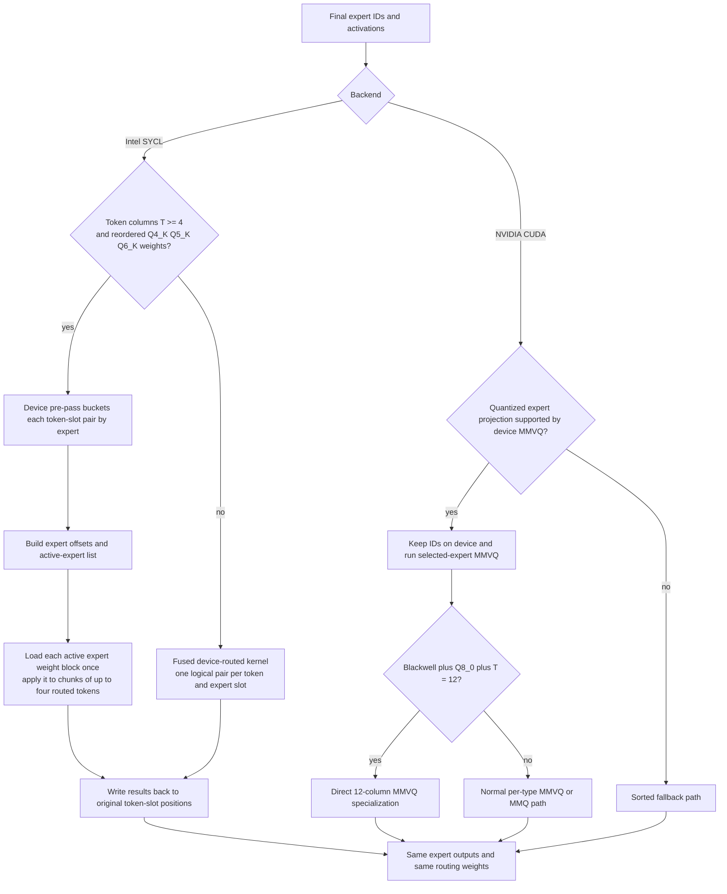

# How Treebeard routes Qwen3.6 MoE tokens

[Model package](https://huggingface.co/Frosty40/Treebeard-Qwen3.6-35B-A3B-GGUF)
| [GitHub repository](https://github.com/newjordan/treebeard)
| [MoE algorithm explainer](https://newjordan.github.io/treebeard/moe-routing.html)
| [Agent Bench report](https://newjordan.github.io/treebeard/)



> Qwen3.6 computes a probability distribution over 256 routed experts for each
> token, selects and renormalizes the top eight, evaluates only those eight
> SwiGLU MLPs, and adds an independently gated shared expert. Treebeard preserves
> those model semantics while changing the device-side scheduling of the
> selected token-expert pairs on Intel and NVIDIA hardware.

## The short version

Treebeard's Qwen3.6-35B-A3B package has 40 decoder layers. Every layer contains
256 routed experts plus one shared expert. For each token and layer:

1. A router projects the 2,048-element hidden state to 256 logits.
2. Softmax converts those logits into 256 probabilities.
3. Top-k selects eight expert IDs.
4. The eight selected probabilities are renormalized to sum to one.
5. Only those eight routed SwiGLU experts run.
6. Their outputs are weighted and summed.
7. A separate shared SwiGLU expert always runs, controlled by its own sigmoid
   gate.
8. Routed and shared outputs are added, then added to the residual stream.

Treebeard does not change steps 1 through 8. Its Intel and NVIDIA work changes
how step 5 is scheduled after the selected IDs already exist.

## Model constants

| Quantity | Treebeard Qwen3.6-35B-A3B |
| --- | ---: |
| Decoder layers | 40 |
| Hidden width, `d_model` | 2,048 |
| Routed experts per layer | 256 |
| Routed experts selected per token | 8 |
| Shared experts per layer | 1 |
| Expert intermediate width | 512 |
| Router function | softmax |
| Grouped semantic routing | none |
| Inference capacity limit | none |
| Token dropping | none |

The eight routed experts represent 3.125% of the routed expert bank. The shared
expert is additional and always evaluated, so the operational description is
"top-8 routed plus one gated shared branch," not "eight experts total."

## Routing math

Let `x_t` be the post-attention, RMS-normalized hidden state for token `t`, with
`x_t` in `R^2048`. The router matrix produces one logit per routed expert:

```text
z_t = W_router^T x_t                     z_t in R^256
p_t = softmax(z_t)                       p_t in R^256
I_t = TopK(p_t, 8)                       I_t in {0, ..., 255}^8
```

The implementation gathers the selected probabilities and renormalizes them:

```text
denom_t = max(sum(p_t[j] for j in I_t), 2^-14)
alpha_t[i] = p_t[i] / denom_t            for i in I_t
```

The `2^-14` clamp is the smallest normal F16 value and prevents division by
zero. Because the global softmax denominator cancels during top-8
renormalization, this is mathematically equivalent to applying softmax only to
the eight selected logits:

```text
alpha_t[i] = exp(z_t[i]) / sum(exp(z_t[j]) for j in I_t)
```

There is no inference-time selection bias, expert grouping, stochastic route,
capacity factor, or token dropping in this model path. The auxiliary router
loss shown in training configurations does not run during inference.

## Routed expert computation

Each selected routed expert is a 2,048 -> 512 -> 2,048 SwiGLU MLP. For selected
expert `i`:

```text
g_i = W_gate_i^T x_t                     g_i in R^512
u_i = W_up_i^T x_t                       u_i in R^512
h_i = SiLU(g_i) elementwise-mul u_i      h_i in R^512
e_i = W_down_i^T h_i                     e_i in R^2048
```

The routed output is the weighted sum:

```text
y_routed = sum(alpha_t[i] * e_i for i in I_t)
```

In ggml this is represented as three `MUL_MAT_ID` operations. The selected
expert IDs index the gate, up, and down tensor banks, so unselected expert
matrices are not evaluated for that token.

## Shared expert computation

The shared branch has the same 512-element intermediate width but is not part
of the top-8 competition. It has an independent scalar sigmoid gate:

```text
s_t = sigmoid(w_shared^T x_t)
g_s = W_gate_shared^T x_t
u_s = W_up_shared^T x_t
e_s = W_down_shared^T (SiLU(g_s) elementwise-mul u_s)
y_shared = s_t * e_s
```

The layer combines the branches and restores the residual:

```text
y_moe = y_routed + y_shared
r_next = r_attention + y_moe
```

This always-on shared path gives the model a common transformation that does
not depend on winning a sparse router slot.

## Editable Mermaid flowchart



## Treebeard's execution optimization

The model produces two routing artifacts:

- `selected_experts`, shape `[8, T]`;
- `weights`, shape `[1, 8, T]`.

Those artifacts are already final when the backend sees `MUL_MAT_ID`.
Treebeard's backend code may reorder work, but it does not alter either tensor.



### Intel SYCL path

For a multi-token batch, the naive execution grid can reload one expert's
weights for every `(token, expert-slot)` pair. Treebeard optionally performs a
small device-side counting and packing pass:

1. Count the `8 x T` routed pairs per expert.
2. Build offsets and an active-expert list.
3. Pack each pair as `(token, slot)` under its selected expert.
4. Launch over active experts rather than all 256 experts.
5. Reuse each loaded weight block across as many as four routed tokens.
6. Write each result back to its original token and top-8 slot.

The path starts at four token columns because expert collisions become common
enough to repay the extra packing launch. Workgroup packing is shape-aware:
the 512-row gate/up projections use one subgroup, while the 2,048-row down
projection uses four subgroups.

### NVIDIA CUDA path

The CUDA backend also consumes the already-final expert ID tensor. Treebeard
extends the device-routed quantized path so a Blackwell GPU can run Q8_0
selected-expert projections directly at 12 token columns. This matches the
12-slot throughput profile and avoids leaving the fast MMVQ path at that exact
shape.

"12-column routing" would be a misleading phrase. The router still selects
eight experts per token. Twelve refers to concurrent token columns in the
matrix-vector kernel, not the number of experts selected.

## Pseudocode

```python
def qwen36_moe_layer(attention_residual):
    x = rms_norm(attention_residual)

    # Semantic routing: identical across CPU, SYCL, and CUDA.
    logits = router_transpose_matvec(x)       # [256, T]
    probabilities = softmax(logits, axis=0)
    expert_ids = topk(probabilities, k=8)     # [8, T]
    weights = gather(probabilities, expert_ids)
    weights /= clamp_min(sum(weights, axis=0), 2 ** -14)

    routed = 0
    for slot in range(8):
        expert = expert_ids[slot]
        gate = selected_matvec(W_gate, expert, x)
        up = selected_matvec(W_up, expert, x)
        hidden = silu(gate) * up
        down = selected_matvec(W_down, expert, hidden)
        routed += weights[slot] * down

    shared_scale = sigmoid(shared_router_transpose_matvec(x))
    shared_hidden = silu(W_gate_shared.T @ x) * (W_up_shared.T @ x)
    shared = shared_scale * (W_down_shared.T @ shared_hidden)

    return attention_residual + routed + shared
```

The loop is conceptual. The actual implementation represents the selected
expert operations as batched tensors and backend-specific `MUL_MAT_ID` kernels.

## Implementation notes

- The router selects eight routed experts; the shared expert is a separate,
  always-evaluated branch.
- Treebeard preserves router scores and expert IDs; its optimization changes
  selected-expert execution scheduling.
- “12-column” CUDA refers to concurrent token columns in the matrix kernel,
  not to selecting twelve experts.
- The training-time auxiliary router loss is not part of inference.
- Inference routes every token to exactly eight routed experts, with no token
  dropping or fixed capacity limit.
- The 8/256 routed-expert ratio is not the whole-model active-parameter ratio;
  attention, embeddings, output head, and the shared branch also contribute.

## Source map

The description above is tied to Treebeard integration commit
`6a6dc2def952fe5e9b2da81e638968653b6be3db` and the packaged GGUF metadata.

| Topic | Source location |
| --- | --- |
| Qwen uses softmax top-8 with normalized weights | `src/models/qwen35moe.cpp:494`, `src/llama-graph.cpp:1533` |
| Top-k IDs and selected-weight gathering | `src/llama-graph.cpp:1610` |
| Top-8 weight renormalization | `src/llama-graph.cpp:1635` |
| Selected gate/up/down expert projections | `src/llama-graph.cpp:1694`, `src/llama-graph.cpp:1804` |
| Weighted routed reduction | `src/llama-graph.cpp:1821` |
| Shared expert and sigmoid gate | `src/models/qwen35moe.cpp:515` |
| SYCL device grouping and pair packing | `ggml/src/ggml-sycl/mmvq.cpp:2638` |
| SYCL grouped fast-path selection | `ggml/src/ggml-sycl/ggml-sycl.cpp:4482` |
| CUDA Blackwell Q8_0 12-column eligibility | `ggml/src/ggml-cuda/mmvq.cu:254` |
| CUDA direct selected-expert dispatch | `ggml/src/ggml-cuda/ggml-cuda.cu:2670` |

Model metadata was independently read from the packaged GGUF:

```text
architecture                    qwen35moe
block_count                     40
embedding_length                2048
expert_count                    256
expert_used_count               8
expert_feed_forward_length      512
expert_shared_feed_forward_length 512
```
